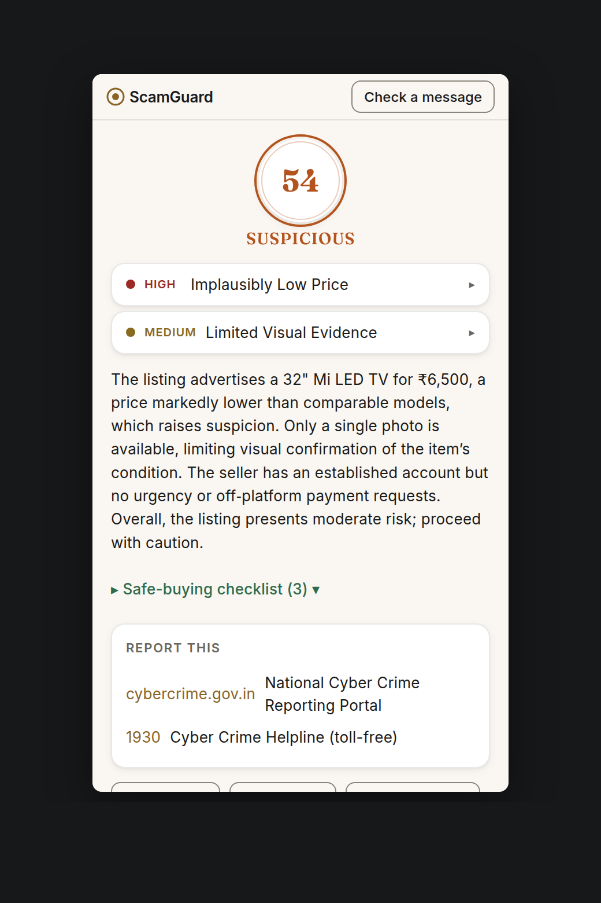
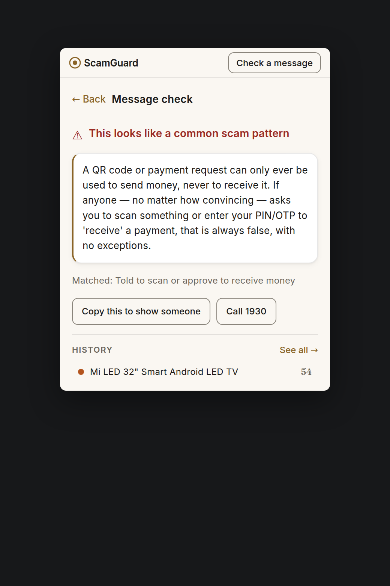
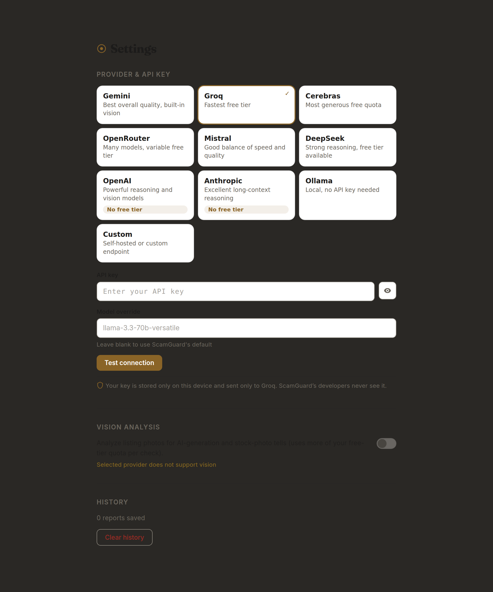

  

<h1 align="center">ScamGaurd</h1>

  <b>Chrome extension that catches marketplace scams on OLX & Quikr — before you pay.</b>

  
  

---

ScamGaurd is a bring-your-own-key Chrome extension for Indian marketplace buyers and sellers. It checks the listing you're about to buy from — and the payment instructions you get in chat — and tells you, in plain language, whether it looks like a scam.

Most damage on OLX & Quikr doesn't happen on the listing page. It happens afterwards, in chat: UPI collect requests framed as refunds, QR codes that "receive" payments, OTP and screen-share requests mid-deal. ScamGaurd is built for both surfaces.

## Screenshots

  
  

  <em>Listing verdict with reasons · Message & Payment Check with the matched scam pattern</em>

  

  <em>Options — provider grid, API key, model override, vision toggle</em>

## What it does

- 🕵️ **Listing check** — instant heuristic risk score on any OLX item or Quikr listing, plus an optional LLM verdict from your own key. Verdict seal in the popup, with the *reasons* behind it.
- 💬 **Message & Payment Check** — paste the chat message before you act. Catches six payment-scam patterns — UPI collect-request and QR "scan-to-receive" tricks, overpayment refunds, OTP/screen-share plays — in English **and** Hinglish.
- 🔑 **Bring your own key** — 10 providers: Groq, OpenRouter, OpenAI, Anthropic, Mistral, DeepSeek, Cerebras, Gemini, local Ollama, or a custom endpoint. No accounts, no subscriptions.
- 🖼️ **Vision analysis** — optional check of listing photos for AI-generation and stock-photo tells.
- 🔒 **Private by design** — keys stay in `chrome.storage.local`, never synced. Heuristic-only mode works fully offline and sends nothing.

### The six payment patterns

| Pattern | What it catches |
|---|---|
| `SCAN_TO_RECEIVE` | "Scan this QR / approve to receive your payment" — scanning a UPI QR can only ever *send* money |
| `COLLECT_REQUEST_FRAMED_AS_REFUND` | A UPI collect request disguised as a refund — approving it pays the other side |
| `FAKE_SCREENSHOT_THEN_QR` | A payment screenshot followed by a scan/approve ask |
| `OVERPAYMENT_REFUND_REQUEST` | "I sent extra by mistake — refund the difference" via QR/request |
| `SCREEN_SHARE_REQUEST` | Remote access / screen-share requested mid-deal |
| `OTP_OR_PIN_REQUEST` | Asking for OTP/PIN/CVV to "verify" or "confirm" |

## Real use cases

**"Scan this QR to receive your payment"** — no legitimate UPI flow brings money in by scanning. ScamGaurd flags `SCAN_TO_RECEIVE` — including Hinglish like *"qr scan karo"* and *"paise receive karne ke liye scan"* — before you approve anything.

**"I paid extra by mistake — approve the refund"** — an approve/collect request takes money out of your account; refunds never need approving. ScamGaurd catches `COLLECT_REQUEST_FRAMED_AS_REFUND` and shows you why.

**Brand-new iPhone at 40% off** — price is the strongest scam signal. The listing check compares the asking price against per-category market tables; anything below ~40% of the expected price is flagged high-severity.

**"Share the OTP so I can confirm delivery"** — OTP/PIN/CVV or screen-share requests are account-takeover plays, not verification. ScamGaurd flags `OTP_OR_PIN_REQUEST` and `SCREEN_SHARE_REQUEST` exactly where they usually appear: mid-deal.

## How it works

1. **Extract** — opening a listing runs the content script (scoped to `olx.in/item/*` and `quikr.com` only): title, price, description, photos. Confidence-graded, never throws.
2. **Score** — a deterministic heuristic engine produces a 0–100 risk score: price-vs-market anomaly tables, language patterns, photo signals. Instant and offline.
3. **Verify (optional)** — your key adds an LLM verdict with tolerant parsing and schema validation, streamed into the popup.
4. **Decide** — scoring fusion produces the verdict seal — Safe / Suspicious / Scam — with plain-language reasons, a safe-buying checklist, and reporting resources (`cybercrime.gov.in`, helpline 1930).

## What it uses

- **Chrome Manifest V3** — service worker, scoped content script, popup + options pages. Permissions: `storage` + `activeTab` only. No `all_urls`.
- **Vanilla JavaScript (ES modules)** — zero runtime dependencies.
- **Deterministic heuristics** — offline risk scoring with per-category price tables and EN/Hinglish language patterns.
- **Optional LLM layer** — 10 providers (see above), model override, vision toggle.
- **Token-driven design system** — light/dark themes via `prefers-color-scheme`, self-hosted fonts (Fraunces + Inter), WCAG AA contrast.

## 🚀 Install

1. `chrome://extensions` → **Developer mode** → **Load unpacked** → select this folder.
2. Open the extension's options page → add a provider key (Groq or OpenRouter work out of the box).
3. Open any OLX item or Quikr listing, or paste a chat message into **Message & Payment Check**.

## Data & privacy

- **Stored locally:** provider key and settings — `chrome.storage.local`, never synced, never seen by ScamGaurd's developers.
- **Sent out:** only the listing or message text you actively check — to the provider you chose, and only with the LLM verdict enabled.
- **Never:** accounts, telemetry, browsing history, or records of your checks.

## Roadmap

- Chrome Web Store release
- Validation against live OLX/Quikr listings
- Additional marketplaces

## License

MIT
