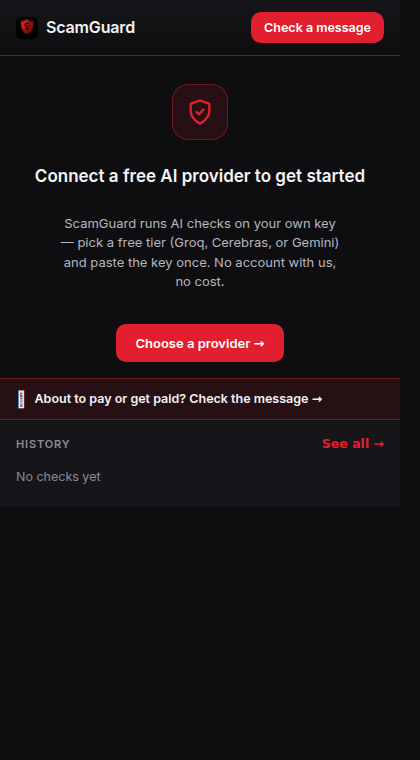
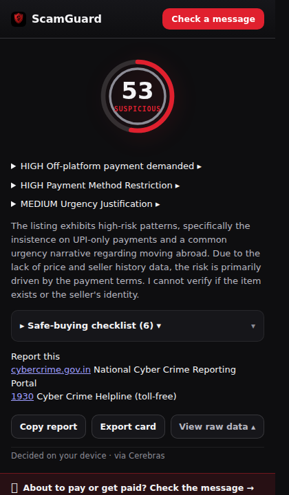

  

<h1 align="center">ScamGuard</h1>

  <b>Chrome extension that catches marketplace scams — before you pay.</b>

  
  
  
  

---

ScamGuard is a bring-your-own-key Chrome extension for marketplace buyers and sellers. It checks the listing you're about to buy from — and the payment instructions you get in chat — and tells you, in plain language, whether it looks like a scam. Works on **OLX, Quikr, Facebook Marketplace, Craigslist**, and any other marketplace page you open.

Most damage on marketplace sites doesn't happen on the listing page. It happens afterwards, in chat: UPI collect requests framed as refunds, QR codes that "receive" payments, OTP and screen-share requests mid-deal. ScamGuard is built for both surfaces.

## Screens

  
  

  <em>Verdict report with live LLM reasoning · First-run onboarding</em>

  
  

  <em>A real live verdict produced through the actual extension service worker · Message &amp; Payment Check</em>

  

  <em>Options — 10-provider grid, free default, model override, vision toggle, history</em>

## What it does

- 🕵️ **Listing check** — a deterministic heuristic score (price-vs-market, language patterns, photo signals) is computed instantly and offline, then fused with an LLM verdict from your own key into the verdict seal. Verdicts: **Likely safe · Review · Suspicious · High-Risk**.
- 💬 **Message & Payment Check** — paste the chat message before you act. Catches six payment-scam patterns — UPI collect-request and QR "scan-to-receive" tricks, overpayment refunds, OTP/screen-share plays — in English **and** Hinglish.
- 🔑 **Bring your own key** — 10 providers: Gemini, Groq, Cerebras, OpenRouter, Mistral, DeepSeek, OpenAI, Anthropic, local Ollama, or a custom endpoint. No accounts, no subscriptions. A curated free default is one click away (OpenRouter free model, no config needed).
- 🖼️ **Vision analysis** — optional check of listing photos for AI-generation and stock-photo tells.
- 🔒 **Private by design** — keys stay in `chrome.storage.local`, never synced. The Message & Payment Check needs no key and runs fully offline; the listing check only contacts the provider you choose, and only when the LLM verdict is enabled.

### The six payment patterns

| Pattern | What it catches |
|---|---|
| `SCAN_TO_RECEIVE` | "Scan this QR / approve to receive your payment" — scanning a UPI QR can only ever *send* money |
| `COLLECT_REQUEST_FRAMED_AS_REFUND` | A UPI collect request disguised as a refund — approving it pays the other side |
| `FAKE_SCREENSHOT_THEN_QR` | A payment screenshot followed by a scan/approve ask |
| `OVERPAYMENT_REFUND_REQUEST` | "I sent extra by mistake — refund the difference" via QR/request |
| `SCREEN_SHARE_REQUEST` | Remote access / screen-share requested mid-deal |
| `OTP_OR_PIN_REQUEST` | Asking for OTP/PIN/CVV to "verify" or "confirm" |

## Real use cases

**"Scan this QR to receive your payment"** — no legitimate UPI flow brings money in by scanning. ScamGuard flags `SCAN_TO_RECEIVE` — including Hinglish like *"qr scan karo"* and *"paise receive karne ke liye scan"* — before you approve anything.

**"I paid extra by mistake — approve the refund"** — an approve/collect request takes money out of your account; refunds never need approving. ScamGuard catches `COLLECT_REQUEST_FRAMED_AS_REFUND` and shows you why.

**Brand-new iPhone at 40% off** — price is the strongest scam signal. The listing check compares the asking price against per-category market tables; anything below ~40% of the expected price is flagged high-severity.

**"Share the OTP so I can confirm delivery"** — OTP/PIN/CVV or screen-share requests are account-takeover plays, not verification. ScamGuard flags `OTP_OR_PIN_REQUEST` and `SCREEN_SHARE_REQUEST` exactly where they usually appear: mid-deal.

## How it works

1. **Extract** — opening a listing runs the content script (scoped to `olx.in/item/*` and `quikr.com` only) or you paste a message: title, price, description, photos. Confidence-graded, never throws.
2. **Score** — a deterministic heuristic engine produces a 0–100 risk score: price-vs-market anomaly tables, language patterns, photo signals. Instant and offline.
3. **Verify (optional)** — your key adds an LLM verdict with tolerant parsing and schema validation, streamed into the popup.
4. **Decide** — scoring fusion produces the verdict seal — Likely safe / Review / Suspicious / High-Risk — with plain-language reasons, a safe-buying checklist, and reporting resources (`cybercrime.gov.in`, helpline 1930).

## Design

- **Red / black / whitish brand system** — derived from the shield mark: brand red `#E0202E` used with restraint (seal arc, verdicts, primary actions), near-black `#0E0E10` surfaces, whitish `#F4F4F6` text. Single deliberate dark theme, strict 8px grid.
- **Self-hosted type** — Space Grotesk for display, Inter for UI (woff2 bundled, no CDN).
- **MV3 from the ground up** — service worker, scoped content script, popup + options pages. Permissions: `storage` + `activeTab` only. No `all_urls`.
- **Zero runtime dependencies** — vanilla JavaScript (ES modules), token-driven CSS, i18n via `chrome.i18n` with bundled `_locales` (en, es, hi).

## Install

1. `chrome://extensions` → **Developer mode** → **Load unpacked** → select this folder.
2. Open the extension's options page → pick a provider, or click **Use ScamGuard's free default** (one click, no config).
3. Open any marketplace listing, or paste a chat message into **Message & Payment Check**.

## Data & privacy

- **Stored locally:** provider key and settings — `chrome.storage.local`, never synced, never seen by ScamGuard's developers.
- **Sent out:** only the listing or message text to the provider you chose, and only when the LLM check is enabled. Message & Payment Check can run fully offline with no key.
- **International:** location-aware reporting resources and patterns; copy localised via `_locales`.

## Tests & verification

- **256 unit tests** — token system, verdict fusion, provider adapters, i18n fallback, manifest integrity — all green.
- **Live E2E** — the extension drives a real provider call through its own service worker (see the live-report screenshot above); the exact request/response pair is captured verbatim in the project audit artifacts.

## Roadmap

- Chrome Web Store release
- More marketplaces and regional patterns
- Optional always-on page icon badge

## License

MIT